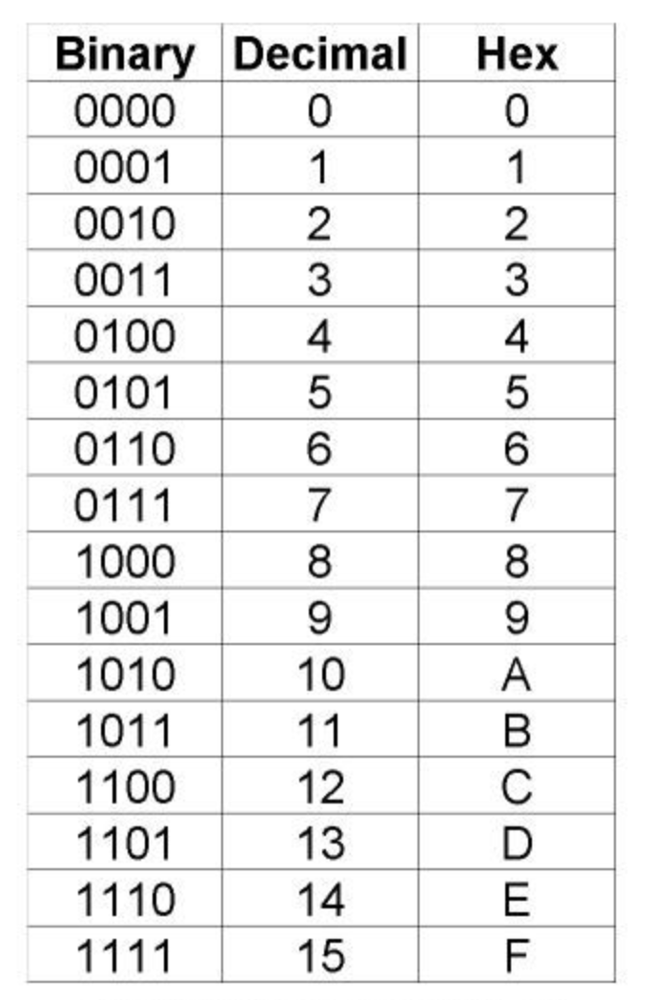

# Status: Completed | Recently Updated
{: .no_toc }

#### Status Rubric
{: .no_toc }

<table class="tg">
<thead>
  <tr>
    <th class="tg-baqh">Completed</th>
    <th class="tg-amwm">In-Progress</th>
    <th class="tg-amwm">Recently Updated</th>
  </tr>
</thead>
<tbody>
  <tr>
    <td class="tg-0lax">All information is up-to-date and has compiled on hydra/tesla</td>
    <td class="tg-0lax">Information is subject to change and has not been tested on hydra/tesla</td>
    <td class="tg-0lax">Information has been recently updated, so you should read the changelog below in case it concerns something you've already completed</td>
  </tr>
</tbody>
</table>

<b>click to view change-log</b>

  

`Fri, 08 Apr 2022 17:43:49 EST`
  - added [Unix/Linux](https://ethan0429.github.io/COSC102-Lab-Writeups/labs/exam2.html#unixlinux) section  

`Fri, 08 Apr 2022 17:43:49 EST`
  - added [Searching Algorithms](https://ethan0429.github.io/COSC102-Lab-Writeups/labs/exam2.html#searching-algorithms) section  

`Fri, 08 Apr 2022 17:43:49 EST`
  - added [Sorting Algorithms](https://ethan0429.github.io/COSC102-Lab-Writeups/labs/exam2.html#sorting-algorithms) section  

`Fri, 08 Apr 2022 17:43:49 EST`
  - added [Number Systems](https://ethan0429.github.io/COSC102-Lab-Writeups/labs/exam2.html#number-systems) section  

  

# Exam 2 Review
All topics discussed in detail are referenced by the official study guide for the exam. [Refer to this study guide Camille created](../assets/exam2guide.pdf) for a reference to the exam material.

## Table of contents
{: .no_toc }
- TOC
{:toc}

## Unix/Linux

### What is it?

- `Unix`: the broader family of operating systems including any Linux architecture & MacOSX, as well as others.
- `Linux`: a subset of the `Unix` family, and the quintissential operating system of choice for programmers and systems around the world.

### Commands

- `ls` - stands for **list**. Lists the files in the current directory. `ls -a` shows hidden files as well, and `ls -l` lists the files in more detail i.e. with permissions, date modified, inode, and more.  
- `cd` - stands for **change directory**. Changes current working directory. `cd path/to/dir` will move your current working directory to `path/to/dir`. If you want to move backwards, you'd do `cd ..`  
- `rm` - stands for **remove**. Removes a file with `rm file`. You can remove multiple files as well with `rm file1 file2 ..etc`.  
- `cp` - stands for **copy**. Copies a file from one path to another with `cp src dest`. You can rename a file to another copy with `cp file1 file2`. This creates a copy of `file1` in the current directory with the name `file`. Or its more conventional use is to copy a file from one path to another `cp file ../`. This copies `file` from the current working directory to the parent directory.  
- `ssh` - stands for **Secure Shell**, and allows you to remotely connect to an SSH server. the command is `ssh username@hostname:path/to/start/in`. For Tesla, `username` is your netid, and `hostname` is `tesla#.eecs.utk.edu` with # being whatever number you want up to 20 I think. (don't quote me on that). So to ssh to tesla 1 in your home directory, you would do `ssh netid@tesla1.eecs.utk.edu:~/`  
- `scp` - stands for **secure copy**, and allows you to copy a file from remote to server or from server to remote. Following command copies `file.cpp` from current directory on remote to your home directory on server tesla1 
`scp file.cpp netid@tesla1.eecs.utk.edu:~/` 
Following command copies `file.cpp` from tesla1 home directory to your current directory (`.`) on remote. 
`scp netid@tesla1.eecs.utk.edu:~/file.cpp .`  
- `chmod` stands for **change mode**. It changes the file permissions of a `file` to `mode` in  `chmod mode file`. The mode for `chmod` is an octal representation of the permission bits. `chmod mode file` sets and/or clears the permission bits of a file based on the mode argument. It's pretty confusing in my opinion, so I'm just going to post a description of the mode here
<pre><code class="language-plaintext">Modes may be absolute or symbolic.  An absolute mode is an octal number constructed from the sum of one or more of the
following values:

    4000    (the setuid bit).  Executable files with this bit set will run with effective uid set to the uid of the file
            owner.  Directories with this bit set will force all files and sub-directories created in them to be owned by
            the directory owner and not by the uid of the creating process, if the underlying file system supports this
            feature: see chmod(2) and the suiddir option to mount(8).
    2000    (the setgid bit).  Executable files with this bit set will run with effective gid set to the gid of the file
            owner.
    1000    (the sticky bit).  See chmod(2) and sticky(7).
    0400    Allow read by owner.
    0200    Allow write by owner.
    0100    For files, allow execution by owner.  For directories, allow the owner to search in the directory.
    0040    Allow read by group members.
    0020    Allow write by group members.
    0010    For files, allow execution by group members.  For directories, allow group members to search in the directory.
    0004    Allow read by others.
    0002    Allow write by others.
    0001    For files, allow execution by others.  For directories allow others to search in the directory.</code></pre>

## Searching Algorithms

### Linear Search

A linear search is the most simple method of searching for an element in some list, and is also quite slow. It simply iterates through a list until the iterator is equal to the element being searched for or it reaches the end of the list.  Linear search example

<pre><code class="language-cpp">// searching for 10 in list of 10 integers
// assume list is {1, 2, 3, 4, 5, 6, 7, 8, 9, 10}

for (int i = 0; i &lt; list.size(); i++) {
    if (list[i] == 10) {
        cout &lt;&lt; "10 is in the list!\n";
    }
}</code></pre>

As you can see, we had to search to the end of the list to find 10, which can be quite costly when lists are far larger in the real world.

### Binary Search

A binary search is a very effective way of searching for an element in some list, however it only works on pre-sorted lists. It works by continuously partitioning an initial list into halves of itself based on the median value of the elements in the list until it finds the value or until there is no more partitioning that can be done. Here is an animation of binary search working to find a value `705` in a list of 32 numbers

<video controls="controls" width="800" height="600" name="Video Name">
  <source src="../img/binsearch.mov">
</video>  It might look like a lot more steps, but in practice it ends up being much faster than linear search.

## Sorting Algorithms

### Bubble Sort

Bubble sort is one of the slowest sorting algorithms, so its method is pretty rudimentary. It works by maintaining two consecutive elements at a time within a list, and swapping those two elements based on order if need be. It loops through the list and does this as many times as needed until the whole list is sorted. Here is a visualization of the algorithm

<video controls="controls" width="800" height="600" name="Video Name">
  <source src="../img/bubblesort.mov">
</video>  As you can see, it takes forever to sort a list of even this small size. Hence why it's not very practical.

### Selection Sort

Selection sort is a step up! It works by combing through every element in a list, and comparing each element in that list to every other element in that list that's not sorted. Then you swap an unsorted element with whatever you've determined to be a minimum element -- if one is found. Hopefully that makes sense. Here's a visual representation of the algorithm

<video controls="controls" width="800" height="600" name="Video Name">
  <source src="../img/ss.mov">
</video>  

### Insertion Sort

Finally for you'll need to know insertion sort. It works by going through the entire list and moving the current element back in the list based on order. Here is an animation of the algorithm

<video controls="controls" width="800" height="600" name="Video Name">
  <source src="../img/inssort.mov">
</video>

## Number Systems

### Binary

Binary is just another way to represent a number, except the only numbers we can work with are 0 & 1. Each subsequent bit (starting from the right) represents a decimal number of 2^i, where `i` is the index of the string from right to left. 

<pre><code class="language-plaintext">1 0 0 0
^
i=3</code></pre>

2^3 is 8, so this string represents 8 in decimal.

<pre><code class="language-plaintext">1
^
i=0</code></pre>

2^0 is 1, so this string represents 1 in decimal.

If you have more than one set bit, then you just add up the sum of each bit calculation

<pre><code class="language-plaintext">1 0 0 1
^     ^
i=3   i=0</code></pre>

2^3 is 8, and 2^0 is 1. 8 + 1 = 9, so this string represents 9 in decimal. It's really pretty simple, just tedious!  A binary stream could be infinitely long, like any number. However in programming languages, we create templates of binary strings because we have limited memory, and this allows us to define certain types based on the constraints we set.  An `int` holds 32 bits on most machines in C++, a `char` holds 8 bits on every machine ever pretty much. **Here's a little secret**, a `char` and an `int` are really the same thing. An `int` can just hold a wider range of numbers than a `char`. They're all just bits! For `char` though, we translate the binary to an ASCII table mapping which maps specific decimal numbers to specific characters.

### Hexadecimal

Hexadecimal is always confusing at first, BUT it's your best friend when dealing with bits/bytes. It's just a more compact, and frankly easier way to represent binary numbers. Every hexadecimal number is preceded with `0x` just by convention. It means nothing other than telling whoever is reading that the number that follows is hex.  Where binary can only use numbers 1 & 2, hex can use numbers 0-9 AND *letters* A-F (or a-f, just be consistent with case).  Here's a table that shows the relation between binary, decimal, and hex.

From the table, you should be able to see that a single hex digit is able to represent 4 binary digits, which makes it much easier for representing binary in a compact form. Now what happens when you you increment `0xF` by 1? It becomes `0x10`. Let's keep going.

- `0x10 + 1 = 0x11`
- `0x11 + 1 = 0x12`
- `0x12 + 1 = 0x13`
- `0x13 + 1 = 0x14`
- `0x14 + 1 = 0x15`
- `0x15 + 1 = 0x16`
- `0x16 + 1 = 0x17`
- `0x17 + 1 = 0x18`
- `0x18 + 1 = 0x19`
- `0x19 + 1 = 0x1A`
- `0x1A + 1 = 0x1B`
- `0x1B + 1 = 0x1C`
- `0x1C + 1 = 0x1D`
- `0x1D + 1 = 0x1E`
- `0x1E + 1 = 0x1F`
- `0x1F + 1 = 0x20` ⬅️ See here we've restarted again. You won't add an entirely new digit until all currently existing digits are `F`. so `0xFF + 1 = 0x100`. So a fairly small hex number of hex digits can hold a very large number! Pretty cool.  **Note that hexadecimal is base-16, binary is base-2, and decimal is base-10**. The base determines when you create a new digit.

## Converting To/From Binary & Hex

### Binary to Hex

Converting binary to hex is simple. A single hex digit can hold 4 binary digits, so it makes it a bit easier to break up your binary string into groups of 4 bits. If your binary string is less than 4 bits, it might be useful to pad your string with 0s until it's 4 long. Let's convert the following binary string to hexadecimal

<pre><code class="language-plaintext">1000 1111 // 143 in binary
</code></pre>

Now we isolate each group of 4 bits. The first group is `1000`, which is 8 in decimal. 8 in decimal is also 8 in hex, so lets label that grouping of bits with its hex equivalent.

<pre><code class="language-plaintext">      1000 1111 // 143 in binary
     |    |
0x   |8   |
</code></pre>

Now isolate the 2nd group of 4 bits `1111`, which is 15 in decimal. 15 in decimal is `F` in hex, so let's lael that grouping of bits with its hex equivalent.

<pre><code class="language-plaintext">      1000 1111 // 143 in binary
     |    |
0x   | 8  | F
</code></pre>

So from our numbers at the bottom, we have just concatenate the sequence `0x + 8 + F` (not arithmetic, just concatenating like a string) and we get `0x8F` which is the hex representation of the binary number!

### Hex to Binary

Converting hex to binary is pretty much the same process just reversed. If we have the hex number `0xAC`, then you separate each hex digit into 4 bits. So, starting slow, lets make 2 groups of 4 blank bits

<pre><code class="language-plaintext">0000 0000
</code></pre>

So now starting from the first digit to the left of our hex number `0xAC`, just translate it to decimal and then to binary. `A` in decimal is 10, so our first group of 4 bits (from the left) should be 10, but in binary.

<pre><code class="language-plaintext">1010 0000
</code></pre>

`1010` is 10 in decimal, which is `A` in hex. Now go to the next hex digit `C` and do the same for the last group of 4 bits. `C` is 12 in decimal, so our last group of 4 bits (from the left) should be 12, but in binary

<pre><code class="language-plaintext">1010 1100
</code></pre>

And there you have it! `1010 1100` is `0xAC` in binary!

### Hex to Decimal

Hex is in base-16, so here's how you convert from hex to decimal  Starting from the right of the hex string `0xAC`, add up each digit's decimal representation times (16^i) where `i` is the index of the digit (from the right)

<pre><code class="language-plaintext">0x  A        C
    ^        ^
    i=1      i=0
    A=10     C=12
    10*16^1  12*16^0
    =160     =12      | 160 + 12 = 172

Final result: 0xAC = 172
</code></pre>

## Practice Questions

  
1. Put the following numbers in order from smallest to largest:
  <code>0xBA, 0x12, 0xF1, 0x1F</code>

   <pre>   Solution:
   0x12, 0x1F, 0xBA, 0xF1</pre>

  
2. Convert <code>0xBA</code> to decimal.

<pre>   Solution: 186</pre>

3. Convert <code>1110 0001</code> to hexadecimal.

   <pre>   Solution: 0xE1
   1st set: 1110 is 8s, 4s, and 2s place (14) = E (or, it's 1111 which is F minus 1, so E)
   2nd set: 0001 is 1s place only, so 1.
   0xE1
.</pre>
   

Here's one with two ops together:
<code>(1101 0111) & (1 << 2)</code>

   <pre>   Solution:
    (1101 0111)
   &(0000 0100)
   =(0000 0100)</pre>
   

4. Part 1: Perform the operation: <code>~(1101)</code>

   <pre>Solution: 0010</pre>
   

Part 2: What does this effectively perform? a. sets all the bits, b. clears all the bits, or c. flips all the bits

     <pre>Solution: C</pre>
     

     

5. Given this array: <code>{5, 8, 1, 3, 5, 9, 0, 2}</code>
   What is the state of the array after... 
   1 step in bubble sort?   <code>{5, 8, 1, 3, 5, 9, 0, 2}</code> 
   2 steps in bubble sort?  <code>{5, 1, 8, 3, 5, 9, 0, 2}</code> 
   3 steps in bubble sort?  <code>{5, 1, 3, 8, 5, 9, 0, 2}</code>

   <pre>   (1st pair is 5 and 8, no swap performed)
   (Next pair is 8 and 1, swap)
   (Next pair is 8 and 3, swap)</pre>
   

6. The ASCII value of 'Y' is <code>0x59</code>. What is the ASCII value of 'Z'?

   <pre>Answer: 0x5A (They do not need to memorize the ASCII table,  but should know that the alphabet is in order. So 0x59 + 1 is 0x5A</pre>
   

7.  I run an <code>ls -l</code> command inside a directory, and see this as output:  
<code>-rw-r--r--@ 1 ccc  staff  2090 Apr  7 10:36 myfile.txt</code> 
Part 1: 
What are the user's permissions?

<pre>Answer: read, write</pre>

Part 2:  
How would we change the permissions for the user and world permissions to remain the same, but the group have read and write permissions?

<pre>Answer: chmod 664 myfile.txt</pre>

That's all!